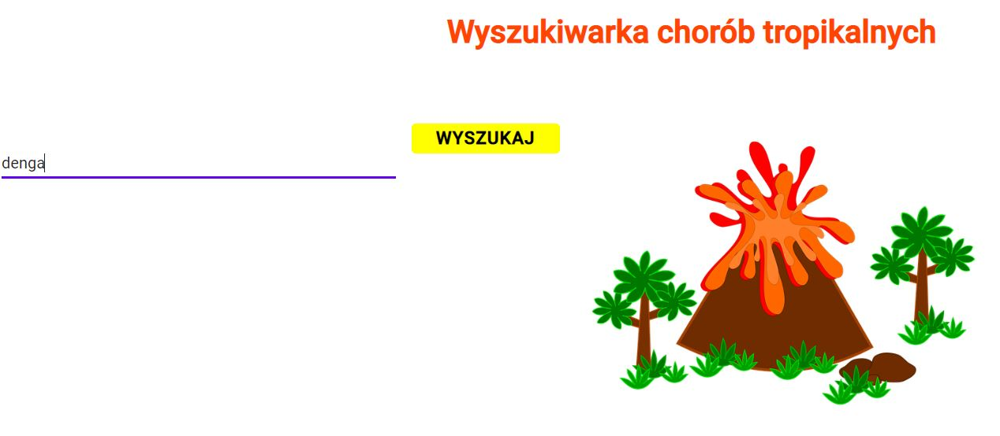
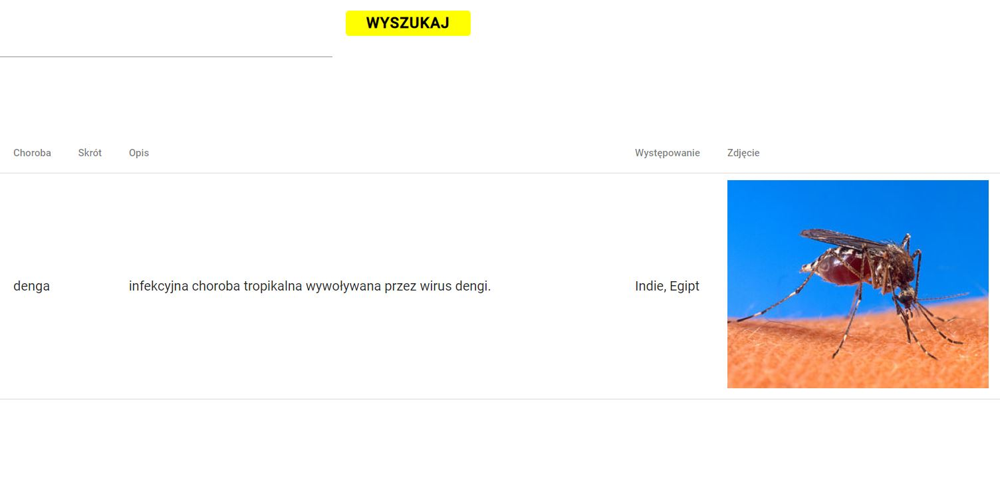
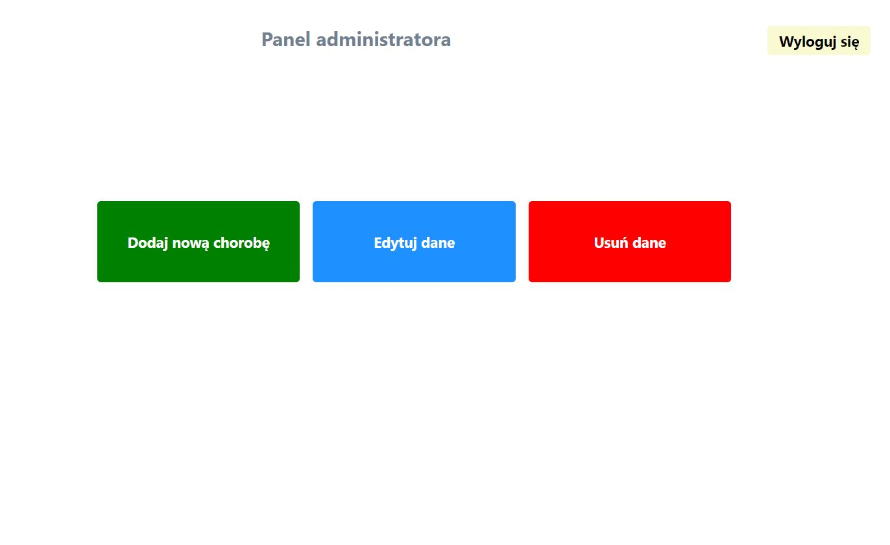
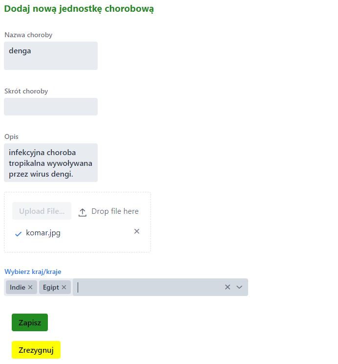
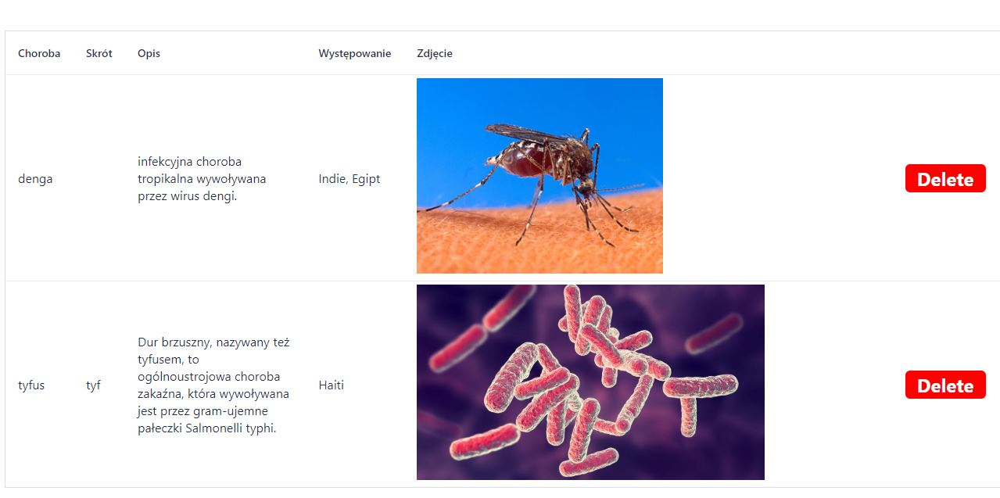

# Search-for-travelers

## Table of contents
* [General info](#general-info)
* [Technologies](#technologies)
* [Screenshots](#screenshots)
* [Installation](#installation)
* [Status](#status)

## General info

This app allows:
- searching for a disease in a given country by everyone
- admin login
- adding new diseases by admin
- edition of the added disease by admin
- removal of the disease by the admin
- logout

## Technologies
* [Spring Boot] - version 2.1.6
* [Vaadin] - version 14.0.1

## Screenshots

### Main Page



### Search Page



### Admin Panel



### Add disease



### Delete disease



## Installation
This app is a Spring Boot application built using Maven. You can build a jar file and run it from the command line:

git clone https://github.com/martad1388/Search-for-travelers
```sh
cd Search-for-travelers
./mvnw package
java -jar target/*.jar
```

You can then access app here: http://localhost:8069/

## Status
Project is: _in progress_

License
----

MIT

Photos from [Pixabay]


[Spring Boot]: <https://spring.io/projects/spring-boot>
[Vaadin]: <https://vaadin.com/releases>
[Pixabay]: <https://pixabay.com/pl/>

